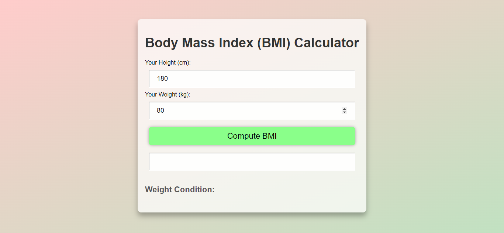

# BMI Calculator

A simple Body Mass Index (BMI) calculator web application.

## Table of Contents

- [Description](#description)
- [Features](#features)
- [Installation](#installation)
- [Usage](#usage)
- [Demo](#demo)
- [Contributing](#contributing)

## Description

This BMI Calculator is a web application that allows users to calculate their BMI based on their height and weight. The application also provides information about the weight condition based on the calculated BMI.

## Features

- Input for height in centimeters.
- Input for weight in kilograms.
- Button to compute BMI.
- Display of BMI value.
- Information about weight condition.

## Installation

1. Clone the repository:

   ```bash
   git clone https://github.com/MohcineSafi/bmi-calculator.git
   ```

2. Open `index.html` in a web browser.

## Usage

1. Enter your height in centimeters.
2. Enter your weight in kilograms.
3. Click the "Compute BMI" button.
4. View the calculated BMI and weight condition.

## Demo



## Contributing

Contributions are welcome! Please follow the Contributing Guidelines.
